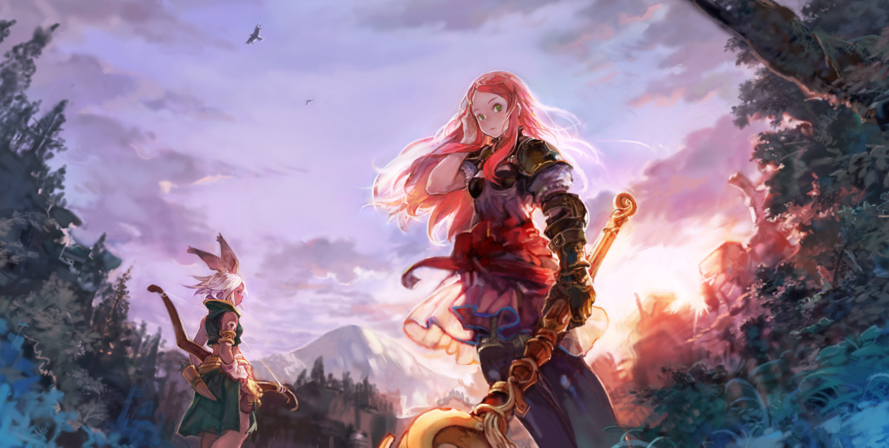
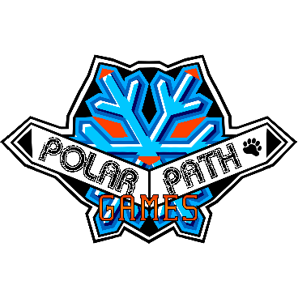
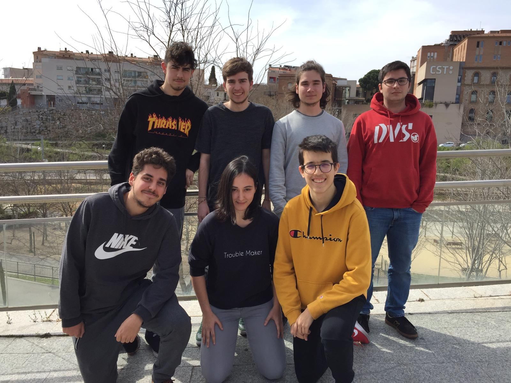
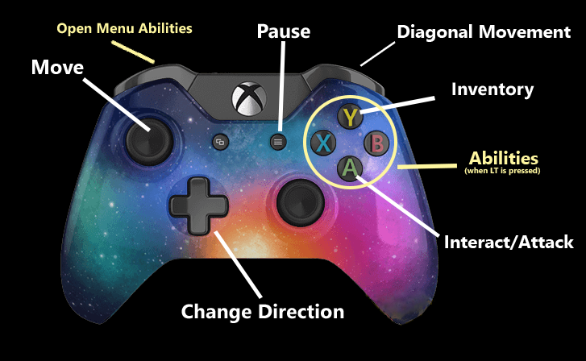

# Final Fantasy Mystery World
 (extracted from: https://www.zerochan.net/687807) 

Final Fantasy Mystery World is a Roguelike game based on Final Fantasy Tactics Advance. The player will enter in a book that will take him to the world of Final Fantasy. In order to help his friend, the hero will travel around the kingdom to rescue him from the claws of an evil monster. When the protagonist just arrives at this newly world, he/she meets a little creature that will help him to get stronger.

The player will have the option to choose between different types of hero classes, with different stats and abilities that makes the gameplay more strategic. The player will go through different maps, defeating enemies and collecting items, so that in the end, get the reward of the quest.

## Team: Polar Path Games
Polar Path Games is a videogame company originated in the subject of "Project 2" in the second year of the university course in Terrassa, Catalonia, Spain, called: Video Game Design and Development in CITM (UPC). We are a group of seven students full of illusion to make a great game. We already have participated in other smalls projects at university and also out of it. It is our first game that we make together and will we the biggest game we will made since now. Our objective is to make a funny game that makes you remember it for a long time. Breaking ice, Creating steps.


_(Team Logo)_


_(First row, from left to right: Marc Gálvez, Oriol Capdevila, Enric Pérez, Iván Ropero;_
_Second row, from left to right: Christian Martínez, Nadine Gutiérrez, Lluís Moreu)_

Each member has a role in the team, in order to cover all project responsabilities.  Every member will specialize in its role, although, that is not significate we will help each others in other areas. Then, the roles distribution is:

**Lead** - Christian Martínez de la Rosa [christt105](https://github.com/christt105)

**Manager** - Lluís Moreu Farran [youis11](https://github.com/youis11)

**UI** - Enric Pérez Rifà [PerezEnric](https://github.com/PerezEnric)

**QA** - Iván Ropero García [RoperoIvan](https://github.com/RoperoIvan)

**Designer** - Marc Gálvez [optus23](https://github.com/optus23)

**Artist** - Nadine Gutiérrez [Nadine044](https://github.com/Nadine044)

**Code** - Oriol Capdevila [OriolCS2](https://github.com/OriolCS2)

## Controls


## Social Media
In order to show the project advancements, releases and other information, you can follow us in our social media. We will upload weekly content. For any message or suggestion you can talk with us in the next social media. We will appreciate any interaction.

 [@polarpathgames](https://twitter.com/polarpathgames)

 [@polarpathgames](https://www.instagram.com/polarpathgames/)

 [PolarPath Games](https://www.youtube.com/channel/UCx2jJZu3o-egIp2R8nH6vuA?ab_channel=PolarPathGames)

Contact us:
 
polarpathgames@gmail.com

## Teaser Trailer

<iframe width="560" height="315" src="https://www.youtube.com/embed/IiKz0--5gdE" frameborder="0" allow="accelerometer; autoplay; encrypted-media; gyroscope; picture-in-picture" allowfullscreen></iframe>

## License

```
MIT License

Copyright (c) 2019 Polar Path Games

Permission is hereby granted, free of charge, to any person obtaining a copy
of this software and associated documentation files (the "Software"), to deal
in the Software without restriction, including without limitation the rights
to use, copy, modify, merge, publish, distribute, sublicense, and/or sell
copies of the Software, and to permit persons to whom the Software is
furnished to do so, subject to the following conditions:

The above copyright notice and this permission notice shall be included in all
copies or substantial portions of the Software.

THE SOFTWARE IS PROVIDED "AS IS", WITHOUT WARRANTY OF ANY KIND, EXPRESS OR
IMPLIED, INCLUDING BUT NOT LIMITED TO THE WARRANTIES OF MERCHANTABILITY,
FITNESS FOR A PARTICULAR PURPOSE AND NONINFRINGEMENT. IN NO EVENT SHALL THE
AUTHORS OR COPYRIGHT HOLDERS BE LIABLE FOR ANY CLAIM, DAMAGES OR OTHER
LIABILITY, WHETHER IN AN ACTION OF CONTRACT, TORT OR OTHERWISE, ARISING FROM,
OUT OF OR IN CONNECTION WITH THE SOFTWARE OR THE USE OR OTHER DEALINGS IN THE
SOFTWARE.
```
